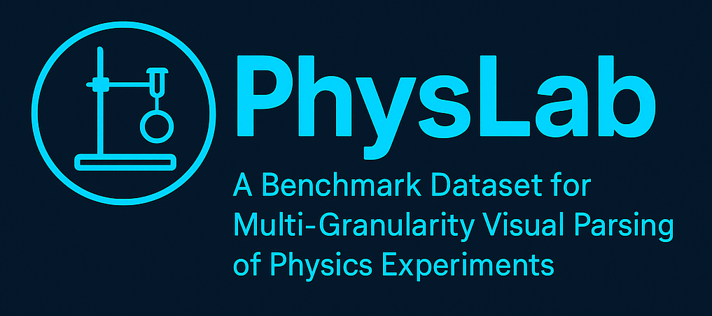

# PhysLab: A Benchmark Dataset for Multi-Granularity Visual Parsing of Physics Experiments

 

## 🌐 Introduction

**PhysLab is the first video dataset for visual interpretation of physics experimental processes!**

**We have comprehensively annotated PhysLab across multiple aspects to support a wide range of computer vision research!**

**we have established benchmark results for eight fundamental vision tasks on PhysLab for reference and comparison!**

## 🔎 Temporal Annotations

The PhysLab dataset contains 620 long videos of four physical experiments, covering 3873 action clips of 32 types of actions, with an average length of 20 seconds per clip and a video frame rate of 30FPS. It subset provides valuable resources for video temporal research such as temporal action proposal, action classification, action alignment, and action segmentation.

  

### Statistics

### Experimental Results.

- **temporal action proposal**

- **Action Classification**

- **temporal action proposal**

- **temporal action proposal**

- DET: contains 4,500 experimental images, covering conventional boundary annotations of object instances, occlusion annotations, human-object interaction annotations, and scene map annotations.

  

- SG: Contains about 3097 images, which are annotated with fine-grained instance segmentation, involving pixel-level category information of human body parts of operating students and physical experimental equipment, supporting instance segmentation, semantic segmentation and other research.

  

- MM: Currently under development, the goal is to integrate text and image data of the experimental process to support multimodal research, including advanced visual tasks such as image description generation, text description generation, and cross-modal alignment.

  

## 📣 Note

At present, we have completely completed the annotation of action classification, temporal action detection, action recognition, object detection, occlusion detection, human-object interaction detection, and instance segmentation related research. The annotation of visual text alignment is still in progress. We will release and provide benchmark performance in a timely manner.

At present, we are integrating multiple types of annotations and achieving accurate alignment between them. We have provided some samples for reference. The complete data is expected to be released within three months. Please continue to follow our dynamics.

At present, we are supplementing data samples of six other experimental types and building collection devices for chemical and biological experiments.

## Disclaimer

The physical experiment dataset provided by this project is collected and annotated based on specific experimental scenarios and methods, but the dataset may contain a certain degree of deviation, incompleteness or erroneous information. Therefore, this dataset is for reference and research purposes only, and its absolute accuracy and applicability are not guaranteed. The results of analysis, modeling or other research activities using this dataset may contain errors or deviations and cannot be directly used for practical applications or decision-making. This project is not responsible for any consequences or losses arising from the use of the dataset. Users should bear their own risks when using the dataset and conduct necessary verification and validation of the data and research results.

