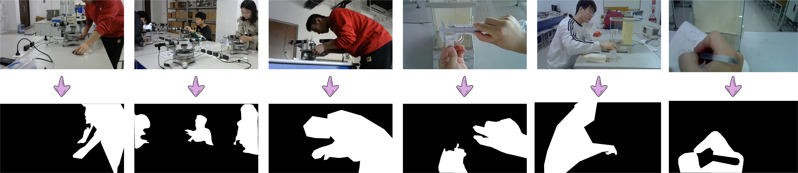

# PhysLab: A Benchmark Dataset for Multi-Granularity Visual Parsing of Physics Experiments

 

## 🌐 Introduction

🚀 **PhysLab is the first video dataset for visual parsing of physics experimental processes!**

🚀 **We provide rich multi-level annotations to support diverse computer vision research!**

🚀 **Benchmark results on eight core vision tasks are established for comparison and reference!**

## 🌐 Experimental Instruction

  

## 🔎 Temporal Parsing

### 📸 Annotation Samples

  

### 📝 Statistics

The PhysLab dataset contains 620 long videos of four physical experiments, covering 3873 action clips of 32 types of actions, with an average length of 20 seconds per clip and a video frame rate of 30FPS. It subset provides valuable resources for video temporal research such as temporal action proposal, action classification, action alignment, and action segmentation.

  
  

  
  

### 🔧 Experimental Results

- **Action Classification**

  

- **Temporal Action Proposal**

  

  

- **Action Alignment & Action Segmentation**

  

## 🔎 Spatial Parising

### 📸 Annotation Samples

  
  

  

  
### 📝 Statistics

**Object Detection:** This subset comprises 6,842 images, annotated with 66,475 object instances across 38 target categories.

**Occlusion Detection:** A total of 7,363 images are used across four experimental settings (1,990; 2,457; 2,008; and 898 images, respectively), including 6,512 occluded positive samples and 851 unoccluded negative samples.

**Instance Segmentation:** This subset includes 3,059 images, covering 38 target categories and 16,437 annotated instances with pixel-level segmentation.

**Interaction Detection:** This subset consists of 4,500 images, this subset involves 34 object categories, 24 verb types, and 130 distinct interaction types, totaling 43,077 interaction instances.

### 🔧 Experimental Results

- **Object Detection**

  

- **Occlusion Detection**

- **Instance Segmentation**

  

- **Human-Object Interaction Detection**

  

## 📣 Note

😆 **At present, we have completely completed the annotation of action classification, temporal action detection, action recognition, object detection, occlusion detection, human-object interaction detection, scene graph generation and instance segmentation related research. The annotation of visual text alignment is still in progress. We will release and provide benchmark performance in a timely manner!**

😄 **At present, we are integrating multiple types of annotations and achieving accurate alignment between them. We have provided some samples for reference. The complete data is expected to be released within one month. Please continue to follow our dynamics!**

😉 **At present, we are supplementing data samples of six other experimental types and building collection devices for chemical and biological experiments!**

## 📥 Download

## 👪 Team

## ⚠️ Disclaimer

The physical experiment dataset provided by this project is collected and annotated based on specific experimental scenarios and methods, but the dataset may contain a certain degree of deviation, incompleteness or erroneous information. Therefore, this dataset is for reference and research purposes only, and its absolute accuracy and applicability are not guaranteed. The results of analysis, modeling or other research activities using this dataset may contain errors or deviations and cannot be directly used for practical applications or decision-making. This project is not responsible for any consequences or losses arising from the use of the dataset. Users should bear their own risks when using the dataset and conduct necessary verification and validation of the data and research results.

