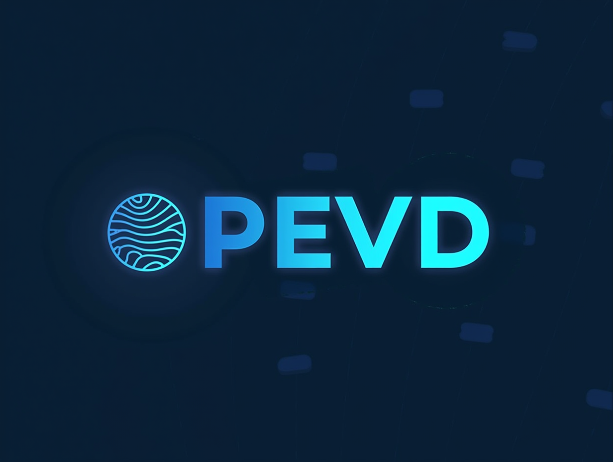
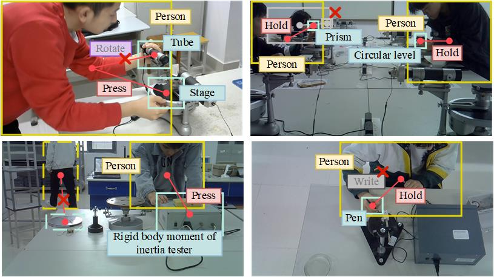

# PhysLab

 

## 🌐Introduction

This project has built and opened up the industry's first physical experiment monitoring dataset that integrates multi-modal and multi-scenario applications - PhysLab. This dataset covers multiple key research areas, including behavior recognition, target detection, instance segmentation, human-computer interaction detection, and scene graph generation, and has carried out comprehensive and detailed data annotation for each field.

The PEVD dataset contains 4 carefully constructed subsets, each of which supports a range of specific research areas. The specific introduction is as follows:

- AR: 620 long videos of four physical experiments are recorded, covering 3873 action clips of 32 types of actions, with an average length of 20 seconds per clip and a video frame rate of 30FPS. This subset provides valuable resources for video behavior research such as action recognition, action segmentation, and behavior prediction.

  

- DET: Contains 16,936 experimental images, covering 137,000 regular samples of object instances, 20,000 occluded samples, and 10,000 interactive samples. This subset supports computer vision tasks such as target detection, occlusion detection, human-computer interaction detection, scene graph generation, and image restoration.

  

- SG: Contains about 5,000 images, which are annotated with fine-grained instance segmentation, involving pixel-level category information of human body parts of operating students and physical experimental equipment, supporting instance segmentation, semantic segmentation and other research.

  

- MM: Currently under development, the goal is to integrate text and image data of the experimental process to support multimodal research, including advanced visual tasks such as image description generation, text description generation, and cross-modal alignment.

  

## Disclaimer

The physical experiment dataset provided by this project is collected and annotated based on specific experimental scenarios and methods, but the dataset may contain a certain degree of deviation, incompleteness or erroneous information. Therefore, this dataset is for reference and research purposes only, and its absolute accuracy and applicability are not guaranteed. The results of analysis, modeling or other research activities using this dataset may contain errors or deviations and cannot be directly used for practical applications or decision-making. This project is not responsible for any consequences or losses arising from the use of the dataset. Users should bear their own risks when using the dataset and conduct necessary verification and validation of the data and research results.
